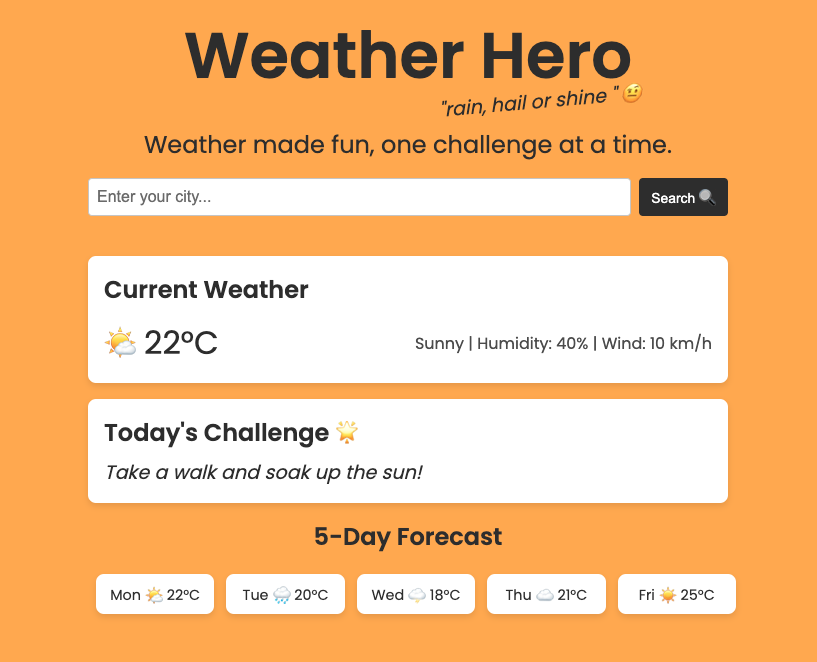

# Weather Hero 🌦️⚡

I created a fun weather app that uses the OpenWeather API to fetch live weather data and generate a challenge based on the weather in your city. 

Live version of the [WeatherHero is here](https://weather-hero-daily-challenge.netlify.app/)

## Features  
- **Real-time Weather**: Get the latest weather updates for any city worldwide.  
- **5-Day Forecast**: View upcoming weather trends in a visually appealing format.  
- **Daily Weather Challenges**: Fun weather-based challenges to engage users.  
- **Interactive UI**: A clean, modern, and responsive design for an enjoyable experience.  

## Technologies Used  
- **Core Stack**: HTML, CSS & JavaScript  
- **OpenWeather API**: Fetches real-time weather data and forecasts.  
- **Dynamic UI Updates**: Weather details update instantly based on user input.  
- **Emoji Integration**: Adds a playful and intuitive element to weather conditions.  

## Goals  
- Make checking the weather **fun and engaging** rather than a routine task.  
- Encourage users to interact with the app through **daily challenges**.  
- Showcase my **front-end development skills** and API integration knowledge.  

## Future Enhancements  
- **Geolocation Support**: Auto-detect user location for instant weather updates.  
- **Theme Customization**: Allow users to change the app’s color scheme.  
- **Expanded Challenges**: More diverse and creative daily weather challenges.  
- **Leaderboard Feature**: Track how many challenges users complete over time.  

## Contributing  
Contributions are welcome! If you'd like to improve, or add to it, feel free to fork the repository and submit a pull request.  

🚀 **Be a Hero, use WeatherHero!** 🌎⚡

